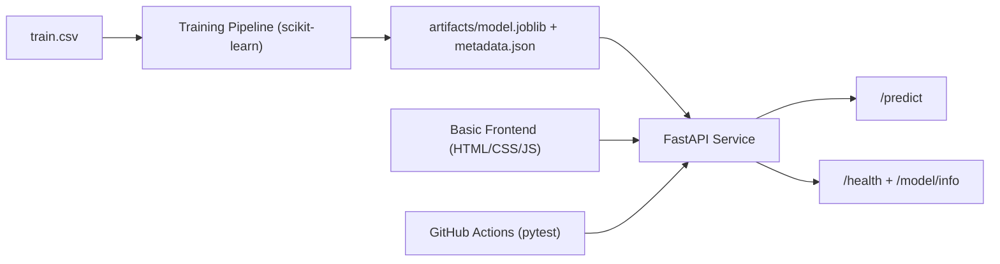

# HouseValue AI - Production-Ready House Price Predictor

An interview-grade ML project built from the Ames housing dataset:
- model training pipeline
- inference API
- basic frontend
- CI tests
- one-command Vercel deployment

## What Makes This Strong in Interviews

- End-to-end ownership: data -> model -> API -> UI -> deployment.
- Production concerns covered: artifact versioning, validation, health checks, request IDs, and automated tests.
- Clear business story: instant price estimation for real-estate assistants and lending workflows.

## Architecture



## Tech Stack

- Python, pandas, scikit-learn
- FastAPI + Uvicorn
- Vanilla HTML/CSS/JS frontend
- pytest
- Docker
- Vercel deployment

## Project Structure

```text
.
|-- api/
|   `-- index.py
|-- app/
|   |-- config.py
|   |-- frontend.py
|   |-- main.py
|   |-- model_service.py
|   `-- schemas.py
|-- artifacts/
|   |-- metadata.json
|   `-- model.joblib
|-- scripts/
|   |-- generate_sample_payload.py
|   `-- train_model.py
|-- src/
|   |-- inference.py
|   `-- training.py
|-- tests/
|   |-- test_api.py
|   `-- test_training.py
|-- vercel.json
`-- README.md
```

## Run Locally

## Real-time Model Monitoring (Industry-style)

This repo includes a local observability stack (Prometheus + Grafana) to view inference throughput/latency plus online error metrics when you send ground-truth feedback.

1. Start API + monitoring:

```bash
docker compose up --build
```

2. Open:
- API: http://localhost:8000
- Prometheus: http://localhost:9090
- Grafana: http://localhost:3000 (user `admin`, password `admin`)

3. Online accuracy metrics (requires ground truth):
- Call `POST /predict` to get `prediction_ids`
- Later call `POST /feedback` with `{ prediction_id, actual_price }`
- Grafana dashboard: `HousePrice / HousePrice - Model Monitoring`

1. Install dependencies:

```bash
pip install -r requirements.txt
```

2. Train model artifacts:

```bash
python train.py
```

3. Start API + frontend:

```bash
uvicorn main:app --host 0.0.0.0 --port 8000 --reload
```

4. Open:
- App: [http://localhost:8000](http://localhost:8000)
- Docs: [http://localhost:8000/docs](http://localhost:8000/docs)

## API Endpoints

- `GET /health`
- `GET /model/info`
- `POST /predict`

Vercel-compatible aliases are also available:
- `/api/health`
- `/api/model/info`
- `/api/predict`

## Example Predict Request

```bash
curl -X POST "http://localhost:8000/predict" \
  -H "Content-Type: application/json" \
  -d @sample_payload.json
```

## Deploy to Vercel

From project root:

```bash
npx vercel --prod --yes
```

After deployment:
- frontend is on the root URL
- API is available at `/api/predict`

## Tests

```bash
pytest
```

Current status: `4 passed`.

## 90-Second Interview Script

1. "I converted a notebook into a deployable ML product."
2. "Training and inference are separated, and artifacts are versioned."
3. "I exposed prediction through FastAPI with validation and observability basics."
4. "I added a frontend so non-technical users can test the model quickly."
5. "I automated quality checks and deployed it on Vercel for live demos."
